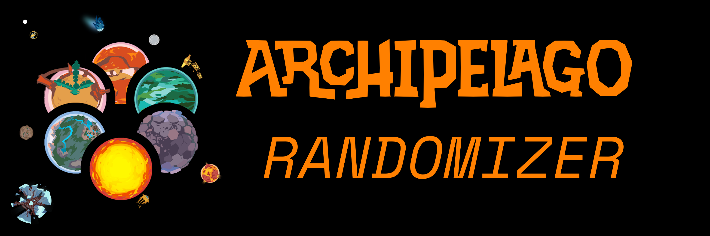

# Outer Wilds Archipelago Randomizer

An [Outer Wilds](https://www.mobiusdigitalgames.com/outer-wilds.html) mod for [the Archipelago multi-game randomizer system](https://archipelago.gg/).

## Status

Public Alpha (as of March 2024).

Several people have played this with no issues or minor issues. Many features are complete, including a full in-game tracker. But we're still missing DLC integration, random spawn, etc. See [Roadmap](#roadmap).

## Contact

For questions, feedback, or discussion related to the randomizer, please visit the "Outer Wilds" thread in [the Archipelago Discord server](https://discord.gg/8Z65BR2), or message me (`ixrec`) directly on Discord.

## What is an "Archipelago Randomizer", and why would I want one?

Let's say I'm playing Outer Wilds, and my friend is playing Ocarina of Time. When I translate some Nomai text in the High Energy Lab, I find my friend's Hookshot, allowing them to reach several OoT chests they couldn't before. In one of those chests they find my Signalscope, allowing me to scan all the signals in the OW solar system. I scan Chert's Drum signal, and find my friend's Ocarina. This continues until we both find enough of our items to finish our games.

In essence, a multi-game randomizer system like Archipelago allows a group of friends to each bring whatever games they want (if they have an Archipelago mod) and smush them all together into one big cooperative multiplayer experience.

### What This Mod Changes

Randomizers in the Archipelago sense—which are sometimes called "Metroidvania-style" or "progression-based" randomizers—rely on the base game having several progression-blocking items you must find in order to complete the game.
In Outer Wilds progression is usually blocked by player knowledge rather than items, so to make a good randomizer we have to:

- Take away some of your starting equipment: the Translator, the Signalscope, the Scout, and the Ghost Matter Wavelength upgrade for your camera all become items that must be found.
- Turn some of that player knowledge into items. For example, "teleporter knowledge" is replaced by a Nomai Warp Codes item, and the warp pads simply won't work without it. There's also Silent Running Mode, Tornado Aerodynamic Adjustments, Entanglement Rule, Coordinates, and so on.
- Tweak the few items the vanilla game does have: the Launch Codes, Signalscope frequencies, and Signalscope signals.

There are also many non-blocking but still useful items, such as the ship's Autopilot, some Oxygen/Fuel Capacity Upgrades, several Oxygen/Fuel Refills and Marshmallows, and so on.

In randomizer terms: "items" are placed at randomly selected "locations" (while ensuring the game can still be completed). Most of the locations in this randomizer are:

- Notes, tape recorders and fuel tanks left by other Hearthians
- Translating pieces of Nomai text
- Reaching important in-game locations
- Scanning each Signalscope signal source
- Revealing facts in the Ship Log (which is usually also one of the above)

The Ship Log has also been enhanced to show lists and descriptions of every item and location (or in randomizer terms: an "in-game tracker").

## Installation

### Prerequisites

- Make sure you have Outer Wilds installed
- Install the [Outer Wilds Mod Manager](https://outerwildsmods.com/mod-manager/)
- Install the [core Archipelago tools](https://github.com/ArchipelagoMW/Archipelago/releases) (at least version 0.4.4)
- Go to [the Releases page](https://github.com/Ixrec/OuterWildsArchipelagoRandomizer/releases) of this repository and look at the latest release. There should be three files to download: A .zip, an .apworld and a .yaml.

### Archipelago tools setup

- Go to your Archipelago installation folder. Typically that will be `C:\ProgramData\Archipelago`.
- Put the `outer_wilds.apworld` file in `Archipelago\lib\worlds\`.
- Put the `Outer.Wilds.yaml` file in `Archipelago\Players`. You may leave the `.yaml` unchanged to play on default settings, or use your favorite text editor to read and change the settings in it.

#### I've never used Archipelago before. How do I generate a multiworld?

Let's create a randomized "multiworld" with only a single Outer Wilds world in it.

- Make sure `Outer.Wilds.yaml` is the only file in `Archipelago\Players` (subfolders here are fine).
- Double-click on `Archipelago\ArchipelagoGenerate.exe`. You should see a console window appear and then disappear after a few seconds.
- In `Archipelago\output\` there should now be a file with a name like `AP_95887452552422108902.zip`.
- Open https://archipelago.gg/uploads in your favorite web browser, and upload the output .zip you just generated. Click "Create New Room".
- The room page should give you a hostname and port number to connect to, e.g. "archipelago.gg:12345".

For a more complex multiworld, you'd put one `.yaml` file in the `\Players` folder for each world you want to generate. You can have multiple worlds of the same game (each with different settings), as well as several different games, as long as each `.yaml` file has a unique player/slot name. It also doesn't matter who plays which game; it's common for one human player to play more than one game in a multiworld.

### Modding and Running Outer Wilds

- In the Outer Wilds Mod Manager, click on "Get Mods", search for "Archipelago Randomizer", and once you see this mod listed, click the install button to the right of it.
- (**Optional: Other Mods**) Some other mods that I personally like to play with, and that this randomizer is compatible with, include: "Clock" (exactly what it sounds like), "Cheat and Debug Menu" (for its fast-forward button), and "Suit Log" (access the ship log from your suit).
- Now click the big green Run Game button. Note that you must launch Outer Wilds through the Mod Manager in order for the mods to be applied; launching from Steam won't work.
- Once you're at the main menu of Outer Wilds itself, click "New Random Expedition", and you will be asked for connection info such as the hostname and port number. Unless you edited `Outer.Wilds.yaml` (or used multiple `.yaml`s), your slot/player name will be "Hearthian1". And by default, archipelago.gg rooms have no password.

#### What if I want to run a pre-release version for testing, or downgrade to an older version of this mod (so I can finish a longer async)?

Click here to show instructions

To use a pre-release version:

- In the Mod Manager, go to the "Get Mods" section (**not** "Installed Mods")
- Search for "Archipelago Randomizer", click the 3 dots icon next to this mod, and select the "Use Prerelease ..." option

To downgrade to an older version, you'll need to install a `Ixrec.ArchipelagoRandomizer.zip` manually. This repo's Releases page has all the mod `.zip`s for past releases (and the current release `.zip`, which is what the Mod Manager normally downloads for you).

- In the Mod Manager, click the 3 dots icon at the top of the window, and select the "Install From" option
- In this popup, make sure the "Install From" mode on top is set to "URL"
- Go to [this repo's Releases page](https://github.com/Ixrec/OuterWildsArchipelagoRandomizer/releases) and copy the link address to one of the `Ixrec.ArchipelagoRandomizer.zip` files from a previous release. For example, the 0.1.0 .zip link would be "https://github.com/Ixrec/OuterWildsArchipelagoRandomizer/releases/download/release/Ixrec.ArchipelagoRandomizer.zip".
- Back in the Mod Manager popup, paste this link into the "URL" entry below, and click Install.

Either way, the Mod Manager should immediately display the version number of the mod version you installed. Be careful not to click the Fix Issues button until you want to go back to the latest stable mod version.

## Roadmap

After 0.2.0 is fully released...

### 0.2.1+ Patch Goals

Before moving on to the big features for 0.3.0, I'd like to do at least one more of these smaller features:

- random planet orbits
- random Dark Bramble layout
- random ghost matter patches

### 0.3.0 Goals/Priorities

- Echoes of the Eye DLC integration
	- Possibly randomize the flashlight

- Random player & ship spawn, with spacesuit on, time loop started, and Launch Codes placed in a random location like most other items
	- Random warp pad destinations should go well with this

### (Non-Programmer) Help Wanted

These are features I won't do myself, but if someone else would like these enough that they'd be willing to do the non-programming work for them (playtesting, drafting logic, listing/naming/describing locations, etc), and it turns out they are actually fun to play, I'll happily do the (small) programming part to finish them off.

- Further reducing your starting oxygen, fuel, boost, etc so some of their upgrades become progression items
- "rumorsanity" setting (adds all the ship log "rumors", separately from the "facts")
- "textsanity" setting (every note, casette tape, Nomai text line, dialogue line, etc?)
- More base game progression items: Gravity crystals? The ability to move Nomai orbs?

### Other Ideas (which may not happen)

- In-game hints, by editing the other astronauts' dialogue trees to offer hints about valuable items or locations on their respective planets

- Flavor Text: Edit various NPC conversations and Nomai texts to account for all the randomizer changes

- More trap items/features. Try Anglerfish Trap again? HUD corruption trap? All surfaces have ice physics trap?

- Turn the map screen into a `useful` item, or a trap that disables it?

- "Log Hunt", where the goal is getting N ship logs? Similarly: a Relic Hunt like Outer Relics, or literally by interfacing with Outer Relics?

- A generic API for other OW mods to declare their randomizable stuff

- Test compatibility with more OW mods, especially the co-op mod Quantum Space Buddies

## Mod Compatibility

Outer Wilds mods that have been tested with this Archipelago Randomizer mod include:

- Clock: Just works
- Cheat and Debug Menu: Just works
- Suit Log: Just works
- Unity Explorer: Just works
- Light Bramble (thanks Rever for testing this): Just works, although it makes the "Silent Running Mode" item pointless.
- NomaiVR (thanks Snout for testing this): Awkward but can be made to work. You have to play a little bit with just the AP mod until you get the "Resume Random Expedition" option, then restart with the VR mod, and also turn off gesture tutorials, but then it works.
- Quantum Space Buddies: Awkward but can *probably* be made to work. I believe you would have to use one of the "... Random Expedition" main menu buttons to connect to your AP server, immediately quit back to the main menu, then use either of QSB's main menu buttons to load the game with multiplayer. Please tell us if you can test this properly.

Story/content mods will (at best) work in a technical sense, but it wouldn't make sense to enable one of those alongside this randomizer, because this randomizer only knows how to randomize the vanilla game's content.

## Running From Source

Click here to show instructions

### Prerequisites

In addition to the prerequisites from [Installation](#installation):

- Make sure you have a `git` or Github client
- Install [Visual Studio Community 2022](https://visualstudio.microsoft.com/vs/community/)

### Building and Running the OW Mod

- In the Mod Manager, click the 3 dots icon, and select "Show OWML Folder". It should open something like `%AppData%\OuterWildsModManager\OWML`.
- Open the `Mods/` subfolder.
- In here, create a subfolder for the built mod to live. The name can be anything, but `Ixrec.ArchipelagoRandomizer` fits OWML's usual format.
- Now `git clone` this repository
- Inside your local clone, open `mod/ArchipelagoRandomizer.sln` with Visual Studio. Simply double-clicking it should work.
- Open `mod/ArchipelagoRandomizer.csproj.user` in any text editor (including Visual Studio itself), and make sure its `OutputPath` matches the OWML folder you created earlier.
- Tell Visual Studio to build the solution. Click "Build" then "Build Solution", or press Ctrl+Shift+B.
- Several files should appear in the OWML folder, including an `ArchipelagoRandomizer.dll`
- In the Outer Wilds Mod Manager, make sure your locally built mod shows up, and is checked. Then simply click the big green "Run Game" button.

### The .apworld and .yaml files

- `git clone` my Archipelago fork at https://github.com/Ixrec/Archipelago
- Copy the `worlds/outer_wilds` folder from your local clone over to the `lib/worlds/` folder inside your Archipelago installation folder
  - Optionally: If you need to send this to someone else, such as the host of your player group, you may zip the folder and rename the extension from `.zip` to `.apworld`. That's all an "apworld file" is, after all.
- Run ArchipelagoLauncher.exe in your Archipelago installation folder and select "Generate Template Settings" to create a sample Outer Wilds.yaml file

## Credits

- Axxroy, Groot, Hopop, qwint, Rever, Scipio, Snow, and others in the "Archipelago" Discord server for feedback, discussion and encouragement
- GameWyrm, JohnCorby, Trifid, viovayo, and others from the "Outer Wilds Modding" Discord server for help learning how to mod Unity games in general and Outer Wilds in particular
- GameWyrm for contributing this mod's in-game console and tracker
- Nicopopxd for creating the Outer Wilds "Manual" for Archipelago
- Flitter for talking me into trying out Archipelago randomizers in the first place
- All the Archipelago contributors who made that great multi-randomizer system
- Everyone at Mobius who made this great game

No relation to [the OW story mod called "Archipelago"](https://outerwildsmods.com/mods/archipelago/)
